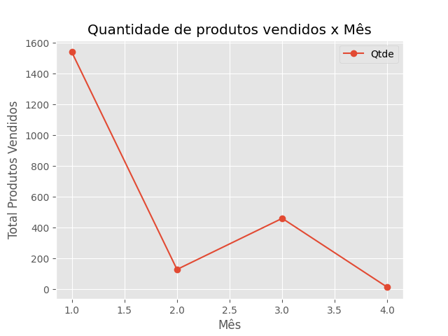

<h1 align="center"> Análise de dados com Python e Pandas </h1>

Curso introdutório de Python para análise de dados com Phyton e Pandas da Dio.

  

 

## 🚀 Tecnologias

Esse projeto foi desenvolvido com as seguintes tecnologias:

- Python
- Pandas
- Excel
- Git e GitHub

## 💻 Projeto

O projeto consiste em analisar dados de vendas de uma empresa no peíodo de 2018 a 2020.

## 🔖 Conteúdo abordado no projeto

- Phyton Básico
- Estrutura de dados
- Introdução a biblioteca Pandas
- Trabalhando com arquivos em Excel
- Trabalhando com datas
- Visualização de dados
- Análise exploratória de dados